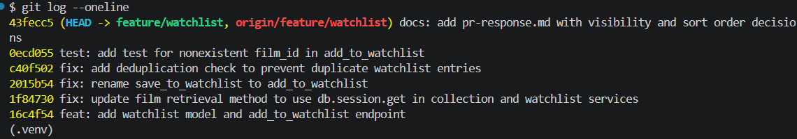

# PR Response Doc — CineLog Watchlist Feature

## AI Usage
I utilized an AI assistant to accelerate codebase orientation and clarify the structure of the existing `add_to_collection()` logic. Additionally, I used the assistant as a sounding board to stress-test the architectural tradeoffs for my design positions regarding default visibility and collection sort order before writing the final arguments.

## Comment 1 — Rename
**What I did:** 
Renamed the core function `save_to_watchlist()` to `add_to_watchlist()` within `services/watchlist_service.py` to match CineLog's standardized `verb_to_noun` naming convention. I then ran a project-wide search to locate all call sites and updated the corresponding endpoint route inside `routes/watchlist/watchlist.py`.

**How I verified:** 
Conducted an IDE text reference scan across all directories to ensure zero instances of `save_to_watchlist` remained, followed by running the unit test suite to confirm the execution paths mapped perfectly to the new function signature.

## Comment 2 — Deduplication
**What I did:** 
Added an identity deduplication check at the top of `add_to_watchlist()` before any records are committed to the database. If a database query finds an entry matching both the `user_id` and `film_id`, it explicitly throws a custom `AlreadyInWatchlistError`.

**How I verified:** 
Modeled the database filter query pattern directly after the approach used in `add_to_collection()` inside `services/collection_service.py`. I verified the logic by asserting that subsequent requests to add the same item fail gracefully with the custom error rather than creating an unhandled database unique constraint failure.

## Comment 3 — Missing test
**What I did:** 
Created the `tests/test_watchlist.py` file from scratch and implemented a dedicated unit test named `test_add_to_watchlist_nonexistent_film_raises`. This test injects a fake UUID string that does not belong to any recorded film and asserts that the service catches the omission.

**How I verified:** 
Structured the test, its execution context, and its mock data fixtures explicitly after the existing `test_add_to_collection_nonexistent_film_raises` found in `tests/test_collection.py`. I verified it by executing `pytest tests/test_watchlist.py -v` and confirming a clean pass.

## Comment 4 — Default visibility
**My position:** 
The watchlist feature should be private by default (`public=False`).

**Reasoning:** 
Defaulting to private preserves user privacy and eliminates psychological friction for CineLog users. Film trackers often wish to save niche, obscure, or deeply personal movies to their watchlist without feeling exposed to public judgment or an immediate activity feed broadcast. Keeping the baseline experience personal encourages higher user engagement and casual, unfiltered bookmarking.

**Tradeoff acknowledged:** 
The primary tradeoff is a reduction in immediate social discovery and natural user interaction across the public CineLog feed. However, this is easily mitigated by providing users with an explicit visibility toggle element directly in the UI when adding or managing their lists, balancing privacy with personal choice.

## Comment 5 — Sort order
**My position:** 
The watchlist must sort entries chronologically by date added descending (`date_added.desc()`), placing the most recently added items at the top.

**Reasoning:** 
A movie watchlist functions heavily as an active pipeline or a "next up" queue. Users interact with lists by pulling up items they recently discovered or saved within the last few days. 

**Engagement with reviewer's point:** 
The maintainer's point is absolutely correct: users naturally expect to see what they added recently. An alphabetical layout breaks down entirely as a user's watchlist scales into dozens or hundreds of items, completely burying newly added content and forcing users to look through long, irrelevant lists. Furthermore, choosing a chronological sort matches the existing paradigm established in `get_collection()`, giving users a highly consistent navigation experience.

## Comment 6 — Rebase
**What conflicted:** 
A data type schema mismatch on the `film_id` field. While our feature branch was active, a refactor merged into the `main` branch that migrated all database primary and foreign keys from standard integers over to unique UUID string patterns.

**How I resolved it:** 
I initiated a `git rebase origin/main` on the feature branch. When the conflict hit, I opened the affected code segments, scrubbed out the legacy integer assumptions, and updated the watchlist model and endpoint handling schemas to accept and process string-based UUID identifiers.

**How I verified no conflict remains:** 
Resolved all code marker regions, completed the rebase pipeline using `git rebase --continue`, and ran a full local regression testing cycle using `pytest tests/ -v` to ensure the entire application runs with zero remaining errors.

## Commit History Log
```text
43fecc5 (HEAD -> feature/watchlist, origin/feature/watchlist) docs: add pr-response.md with visibility and sort order decisions
0ecd055 test: add test for nonexistent film_id in add_to_watchlist
c40f502 fix: add deduplication check to prevent duplicate watchlist entries
2015b54 fix: rename save_to_watchlist to add_to_watchlist
1f84730 fix: update film retrieval method to use db.session.get in collection and watchlist services
16c4f54 feat: add watchlist model and add_to_watchlist endpoint
```

## Commit History Log


```text
43fecc5 (HEAD -> feature/watchlist, origin/feature/watchlist) docs: add pr-response.md with visibility and sort order decisions
```
...

## PR Description
### Feature Overview
This pull request delivers the core CineLog Watchlist feature, allowing users to bookmark and track films they intend to view. It encapsulates secure model constraints, input parameter validations, deduplication controls, and clean error handling patterns that safely align with CineLog's core ecosystem architecture.

### Key Design Decisions
1. **Private by Default:** All watchlist additions default to private (`public=False`) to secure user privacy and lower user bookmarking anxiety.
2. **Chronological Sort Order:** Entries return sorted by date added descending to directly optimize for quick access to newly tracked content and ensure architectural parity with the collection layout.

### Manual Verification Instructions
To verify this feature locally, run the application backend (`python app.py`) and perform the following actions:
1. **Add a Film:** Submit a `POST` request to `/watchlist/<user_id>/add` with a valid `film_id` UUID payload. Verify a `200 OK` response returning the generated watchlist entry object.
2. **Attempt Duplication:** Resubmit the identical payload to the same endpoint. Confirm the response returns an error code and a descriptive message indicating the film already exists in the watchlist.
3. **Invalid Film ID:** Submit a payload containing a nonexistent or malformed `film_id`. Confirm the application drops the entry request and returns a clear `404 Not Found` error matching our defensive service design.